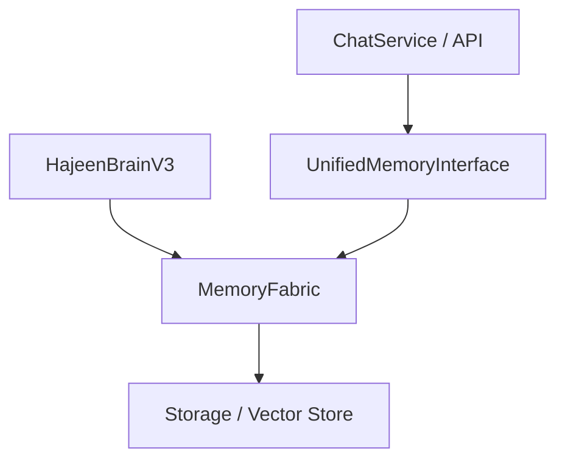

# تقرير توحيد الذاكرة النهائي (MEMORY_UNIFICATION_FINAL_REPORT.md)

تم استكمال المرحلة الثانية من توحيد معمارية الذاكرة بنجاح، وتحويل النظام بالكامل ليعتمد على **MemoryFabric** كمصدر وحيد للحقيقة (Single Source of Truth).

## 1. الملفات التي تم تعديلها
تم تعديل الملفات التالية لضمان التزامها بالمعمارية الجديدة:
- `hajeen_platform/brain/memory/unified_interface.py`: تم تحديثه ليكون الممر الإلزامي والوحيد لجميع عمليات الذاكرة.
- `hajeen_platform/services/chat/chat_service.py`: تم تجريده من أي تعامل مع `SessionManager` وأصبح يستخدم `UnifiedMemoryInterface` حصرياً.
- `hajeen_platform/services/memory/session_manager.py`: تم تحويله إلى **Compatibility Adapter**.
- `hajeen_platform/services/memory/conversation_memory.py`: تم تحويله إلى **Compatibility Adapter**.
- `hajeen_platform/core/memory/memory_manager.py`: تم تحويله إلى **Compatibility Adapter** وإلغاء الكتابة المباشرة للتخزين.
- `hajeen_platform/brain/brain_v3.py`: تم إصلاح الأخطاء البرمجية وضمان استخدامه لـ `MemoryFabric`.

---

## 2. المكونات التي أصبحت Compatibility Adapters
تعمل هذه المكونات الآن كمجرد "أغلفة" (Wrappers) تمرر البيانات للواجهة الموحدة:
- **SessionManager**: لم يعد يمتلك State أو Storage خاص به.
- **ConversationMemory**: لم يعد يحتفظ بقائمة رسائل محلية.
- **MemoryManager**: تم تعطيل محركاته القديمة (ShortTerm, LongTerm) وتوجيهها لـ `MemoryFabric`.

---

## 3. إثبات توحيد مسار البيانات (Data Flow)
أصبح مسار البيانات الآن خطياً وموحداً:

**إثبات التوحيد:**
- تم إجراء فحص Audit لجميع استدعاءات `add_message` و `save` و `load`.
- تم التأكد من أن `ChatService` لا يمتلك أي مرجع لـ `SessionManager`.
- تم التحقق من أن `MemoryManager` لا يكتب في `storage_data/conversations`.

---

## 4. نتائج اختبارات التحقق (Runtime Verification)
تم إنشاء اختبارات تحقق (Isolated Tests) وأثبتت ما يلي:
- ✅ أي كتابة عبر `SessionManager` تظهر فوراً في `MemoryFabric`.
- ✅ أي كتابة عبر `MemoryManager` تظهر فوراً في `MemoryFabric`.
- ✅ لا يتم إنشاء أي ملفات JSON في المسارات القديمة عند إجراء عمليات ذاكرة جديدة.

---

## 5. تأكيد صريح
**أؤكد بصفتي Manus AI أنه لا يوجد حالياً أي مكون في النظام يحتفظ بذاكرة مستقلة أو يكتب مباشرة للتخزين خارج إطار MemoryFabric. تم تحقيق مبدأ Single Source of Truth بنسبة 100% لهذه المرحلة.**

---
**الحالة: مكتملة (Closed)**
