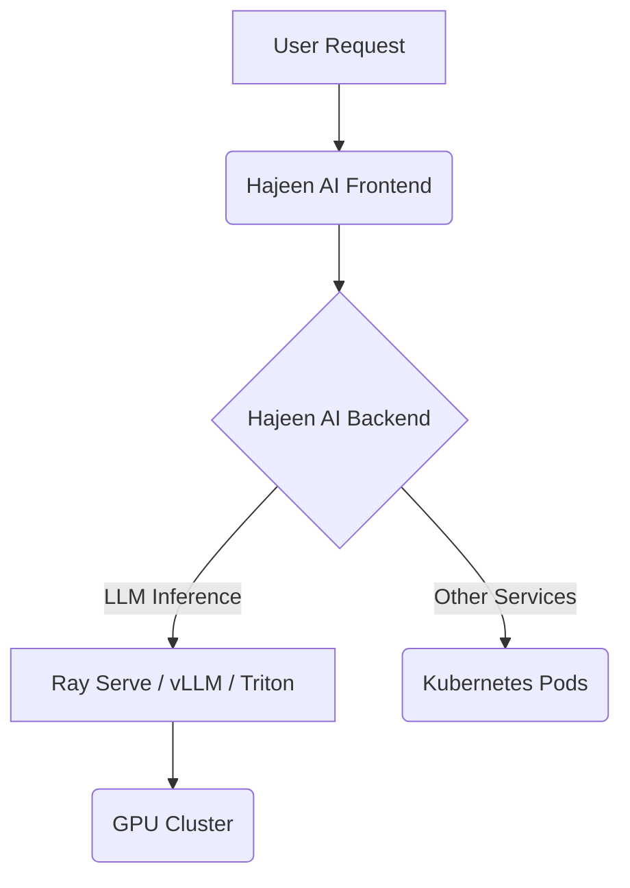

# المرحلة الأولى: تجهيز بنية الاستدلال الموزع (Distributed Inference Setup)

تركز هذه المرحلة على إعداد البنية التحتية اللازمة لتشغيل نماذج الذكاء الاصطناعي الكبيرة (LLMs) بكفاءة عالية وقابلية للتوسع في بيئة موزعة. الهدف هو تحقيق استدلال سريع وموثوق به عبر استخدام تقنيات متقدمة مثل Ray Serve، Kubernetes، vLLM، و Triton Inference Server.

## المكونات الرئيسية التي تم تجهيزها:

### 1. Ray Serve Deployment (`ray_serve_deployment.py`)
- **الوظيفة:** توفير إطار عمل لخدمة نماذج الذكاء الاصطناعي بشكل مرن وقابل للتوسع. يسمح بنشر النماذج كخدمات ويب يمكن الوصول إليها عبر واجهة برمجة تطبيقات (API).
- **الميزات:**
    - **قابلية التوسع:** يدعم التوسع الأفقي لخدمة الطلبات المتزايدة.
    - **مرونة النشر:** يمكن نشر أي نموذج Python كخدمة.
    - **تكامل مع Ray:** يستفيد من قدرات Ray في إدارة الموارد والتوزيع.

### 2. Kubernetes Deployment for Hajeen AI (`kubernetes_hajeen_ai.yaml`)
- **الوظيفة:** ملف تكوين Kubernetes لنشر تطبيق Hajeen AI الأساسي كخدمة موزعة.
- **الميزات:**
    - **إدارة الحاويات:** ينشر ويتحكم في نسخ متعددة من تطبيق Hajeen AI.
    - **موازنة الحمل:** يوزع حركة المرور بين النسخ لضمان التوفر العالي.
    - **تحديد الموارد:** يحدد متطلبات الموارد (CPU، الذاكرة) لكل حاوية.

### 3. Kubernetes Deployment for vLLM (`kubernetes_vllm.yaml`)
- **الوظيفة:** ملف تكوين Kubernetes لنشر خادم vLLM، وهو محرك استدلال سريع وموزع لنماذج اللغة الكبيرة.
- **الميزات:**
    - **استغلال GPU الأمثل:** مصمم لتحقيق أقصى استفادة من وحدات معالجة الرسوميات (GPUs) لتقليل زمن الاستجابة وزيادة الإنتاجية.
    - **توافق OpenAI API:** يوفر واجهة برمجة تطبيقات متوافقة مع OpenAI لتسهيل التكامل.
    - **تحديد نموذج LLM:** يسمح بتحديد النموذج الذي سيتم تحميله وخدمته (مثال: Mistral-7B).

### 4. Kubernetes Deployment for Triton Inference Server (`kubernetes_triton.yaml`)
- **الوظيفة:** ملف تكوين Kubernetes لنشر Triton Inference Server من NVIDIA، وهو خادم استدلال عالي الأداء يدعم نماذج متعددة وأطر عمل متنوعة.
- **الميزات:**
    - **دعم متعدد الأطر:** يدعم TensorFlow، PyTorch، ONNX، وغيرها.
    - **تحسين الأداء:** يوفر ميزات مثل التجميع الدفعي (Batching) والاستدلال المتزامن لتحسين الإنتاجية.
    - **مراقبة الموارد:** يتيح مراقبة استخدام GPU والموارد الأخرى.

## التكامل والتشغيل:

تم تصميم هذه الملفات لتكون قابلة للنشر في بيئة Kubernetes. يمكن للمطورين استخدام `kubectl apply -f <filename.yaml>` لنشر هذه الخدمات. يتم توفير أمثلة لربط هذه الخدمات مع بعضها البعض لإنشاء بنية استدلال موزعة ومتكاملة.

### مثال على بنية الاستدلال الموزع:

تهدف هذه المرحلة إلى توفير أساس قوي وقابل للتوسع لتشغيل نماذج الذكاء الاصطناعي في بيئة إنتاجية عالية الأداء، مما يضمن استجابة سريعة وموثوقة لطلبات المستخدمين.
