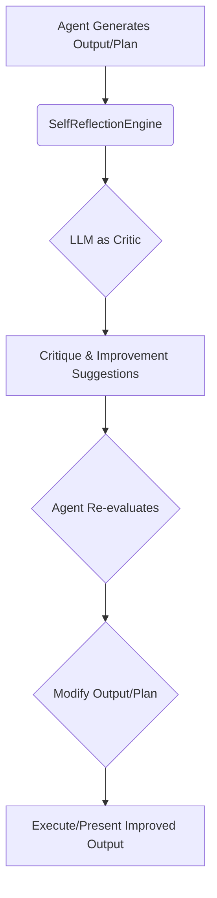

# المرحلة الأولى: بناء محرك التفكير والتقييم الذاتي (Self-Reflection & Critique Engine)

تركز هذه المرحلة على تمكين وكلاء Hajeen AI من التفكير النقدي في مخرجاتهم وخططهم، مما يمثل خطوة أساسية نحو التعلم الذاتي وتحسين الأداء. الهدف هو تقليل الأخطاء، تعزيز جودة الاستدلال، وتطوير قدرة الوكيل على التكيف والتحسين المستمر.

## المكونات الرئيسية التي تم تجهيزها:

### 1. SelfReflectionEngine (`self_reflection_engine.py`)
- **الوظيفة:** محرك مركزي يسمح للوكلاء بإجراء التفكير الذاتي وتقييم مخرجاتهم أو خططهم باستخدام نموذج لغوي كبير (LLM) كـ "ناقد" داخلي.
- **الميزات:**
    - **التفكير في المخرجات (`reflect_on_output`):** يوجه LLM لتقييم مخرجات الوكيل بناءً على معايير محددة (مثل الدقة، الاكتمال، الصلة). يقوم LLM بتقديم تقييم نقدي، درجات، واقتراحات للتحسين.
    - **نقد الخطط (`critique_plan`):** يسمح للوكيل بتقديم خطته إلى LLM ليتم تقييمها بناءً على معايير مثل المنطق، الكفاءة، وقابلية التنفيذ. يتم تقديم ملاحظات واقتراحات لتحسين الخطة.
    - **المرونة:** مصمم ليكون مرنًا، حيث يمكن تحديد معايير التقييم ديناميكيًا بناءً على المهمة أو السياق.

### 2. MockLLM (`self_reflection_engine.py`)
- **الوظيفة:** تنفيذ وهمي (Mock) لنموذج لغوي كبير يستخدم لأغراض الاختبار والتطوير. يحاكي استجابة LLM لطلبات التفكير والنقد.
- **الميزات:**
    - **استجابات محددة مسبقًا:** يوفر استجابات JSON محددة مسبقًا لأنواع مختلفة من طلبات التفكير والنقد، مما يسهل اختبار `SelfReflectionEngine` دون الحاجة إلى LLM حقيقي.

## التكامل والتشغيل:

يتم دمج `SelfReflectionEngine` في مسار عمل الوكيل بحيث يمكن استدعاؤه بعد توليد المخرجات الأولية أو بعد إنشاء خطة. يمكن استخدام النتائج (الدرجات، النقد، التحسينات) لتعديل سلوك الوكيل، إعادة صياغة المخرجات، أو إعادة التخطيط للمهمة.

### مثال على دورة التفكير الذاتي:

تهدف هذه المرحلة إلى تزويد Hajeen AI بقدرة جوهرية على التعلم من أخطائه وتحسين أدائه بشكل مستقل، مما يقلل الاعتماد على التدخل البشري المستمر ويفتح الباب أمام قدرات التعلم الذاتي الأكثر تعقيدًا.
