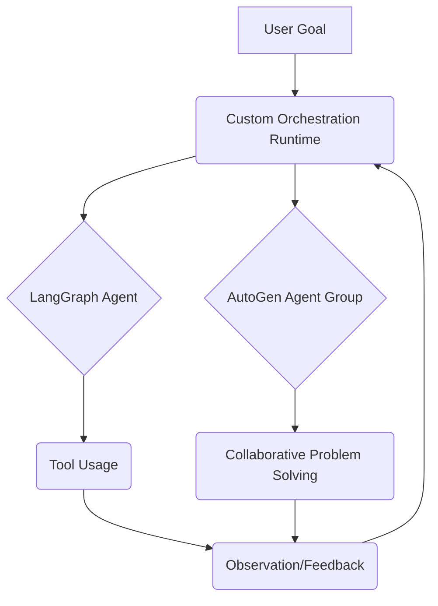

# المرحلة الثانية: تطوير إطار عمل الوكلاء المتقدم (Advanced Agent Framework Development)

تركز هذه المرحلة على تعزيز قدرات الوكلاء في Hajeen AI Platform من خلال دمج أطر عمل متقدمة مثل LangGraph و AutoGen، بالإضافة إلى تطوير وقت تشغيل مخصص للتنسيق (Custom Orchestration Runtime). الهدف هو تمكين الوكلاء من التخطيط الديناميكي، التعاون المعقد، والتنفيذ المرن للمهام.

## المكونات الرئيسية التي تم تجهيزها:

### 1. LangGraph Example (`langgraph_example.py`)
- **الوظيفة:** توفير مثال على كيفية استخدام LangGraph لبناء رسوم بيانية قابلة للتنفيذ (executable graphs) للوكلاء. يسمح بتحديد تسلسلات معقدة من الإجراءات والقرارات التي يمكن للوكيل اتخاذها.
- **الميزات:**
    - **البرمجة الرسومية:** تمكن من تصميم تدفقات عمل الوكلاء كرسوم بيانية، مما يسهل فهم وتعديل سلوك الوكيل.
    - **إدارة الحالة:** يدعم إدارة حالة الوكيل عبر العقد المختلفة في الرسم البياني.
    - **التخطيط الشرطي:** يسمح للوكيل باتخاذ قرارات بناءً على حالة معينة والانتقال إلى عقد مختلفة في الرسم البياني.

### 2. AutoGen Example (`autogen_example.py`)
- **الوظيفة:** توفير مثال على كيفية استخدام AutoGen لإنشاء محادثات متعددة الوكلاء (multi-agent conversations) حيث يمكن للوكلاء التعاون لحل المهام.
- **الميزات:**
    - **الوكلاء القابلون للتخصيص:** يسمح بإنشاء وكلاء بمختلف الأدوار والقدرات (مثل المساعد، وكيل المستخدم).
    - **التواصل التلقائي:** يسهل التواصل التلقائي بين الوكلاء لتبادل المعلومات وحل المشكلات.
    - **تنفيذ الكود:** يدعم تنفيذ الكود بواسطة الوكلاء، مما يمكنهم من التفاعل مع البيئة الخارجية.

### 3. Custom Orchestration Runtime (`custom_orchestration_runtime.py`)
- **الوظيفة:** وقت تشغيل مخصص مصمم لتنسيق ديناميكي ومرن للوكلاء، مع التركيز على تدفقات العمل الموجهة بالأهداف (goal-driven workflows) والتنسيق متعدد الوكلاء.
- **الميزات:**
    - **تدفقات العمل الديناميكية:** يدعم الرسوم البيانية لتدفق العمل الديناميكية وآلات الحالة (state machines).
    - **تنسيق متعدد الوكلاء:** يوفر آليات لتنسيق الوكلاء المتعددين لتحقيق أهداف مشتركة.
    - **قابلية التوسع:** مصمم ليكون قابلاً للتوسع لدعم عدد كبير من الوكلاء والمهام المعقدة.

## التكامل والتشغيل:

تم تصميم هذه المكونات لتوفير المرونة والقوة في بناء أنظمة وكلاء متقدمة. يمكن دمج LangGraph و AutoGen مع Custom Orchestration Runtime لإنشاء حلول وكلاء معقدة وذكية. تهدف هذه المرحلة إلى تمكين Hajeen AI Platform من التعامل مع المهام التي تتطلب تخطيطًا متقدمًا، تعاونًا بين الوكلاء، وقدرة على التكيف مع الظروف المتغيرة.

### مثال على بنية إطار عمل الوكلاء المتقدم:

تهدف هذه المرحلة إلى بناء أساس قوي للذكاء الاصطناعي الوكيلي (Agentic AI) في Hajeen AI Platform، مما يمكنه من التفكير، التخطيط، والتنفيذ بشكل أكثر استقلالية وذكاء.
