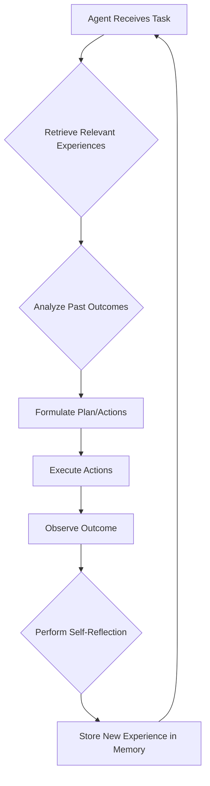

# المرحلة الثانية: تطوير ذاكرة الخبرات والتعلم من التفاعل (Episodic Experience Memory)

تركز هذه المرحلة على تزويد وكلاء Hajeen AI بذاكرة طويلة المدى لتخزين واسترجاع الخبرات السابقة، مما يمكنهم من التعلم من تفاعلاتهم ونتائجها. هذه الذاكرة ضرورية لبناء أنظمة ذكاء اصطناعي قادرة على التكيف، التخطيط بناءً على التجارب السابقة، وتجنب تكرار الأخطاء.

## المكونات الرئيسية التي تم تجهيزها:

### 1. EpisodicMemory (`episodic_memory.py`)
- **الوظيفة:** مكون مركزي لتخزين وإدارة الخبرات العرضية (Episodic Experiences) للوكلاء. كل تجربة تسجل تفاصيل التفاعل، الإجراءات المتخذة، النتيجة، وحالة النجاح أو الفشل، بالإضافة إلى أي تفكير ذاتي (Reflection) تم إجراؤه.
- **الميزات:**
    - **التخزين المستمر:** يتم حفظ الخبرات في ملف JSONL لضمان استمراريتها عبر جلسات التشغيل المختلفة.
    - **إضافة الخبرات (`add_experience`):** يسمح بتسجيل تجربة جديدة تتضمن الموجه الأصلي (prompt)، الإجراءات (actions)، النتيجة (outcome)، حالة النجاح (success)، وأي بيانات وصفية إضافية (metadata) أو نتائج تفكير ذاتي.
    - **استرجاع الخبرات (`retrieve_experiences`):** يوفر آلية بسيطة (حاليًا تعتمد على الكلمات المفتاحية) لاسترجاع الخبرات ذات الصلة بناءً على استعلام. يمكن توسيعها لاحقًا لتشمل البحث المتجه (vector search) لتحسين الدقة.
    - **تصفية الخبرات:** يمكن استرجاع الخبرات الناجحة (`get_successful_experiences`) أو الفاشلة (`get_failed_experiences`) بشكل منفصل، مما يسهل تحليل الأداء والتعلم من الأخطاء.

## التكامل والتشغيل:

تتكامل `EpisodicMemory` مع `SelfReflectionEngine` حيث يمكن تخزين نتائج التفكير الذاتي كجزء من الخبرة. عندما يواجه الوكيل مهمة جديدة، يمكنه استشارة ذاكرة الخبرات لاسترجاع سيناريوهات مماثلة، تحليل الإجراءات التي أدت إلى النجاح أو الفشل، وتعديل خطته أو سلوكه وفقًا لذلك.

### مثال على دورة التعلم من الخبرات:

تهدف هذه المرحلة إلى تزويد Hajeen AI بقدرة حاسمة على التعلم من تاريخه التشغيلي، مما يمكنه من تحسين أدائه بمرور الوقت ويقربه خطوة أخرى نحو الاستقلالية والتعلم الذاتي المستمر.
