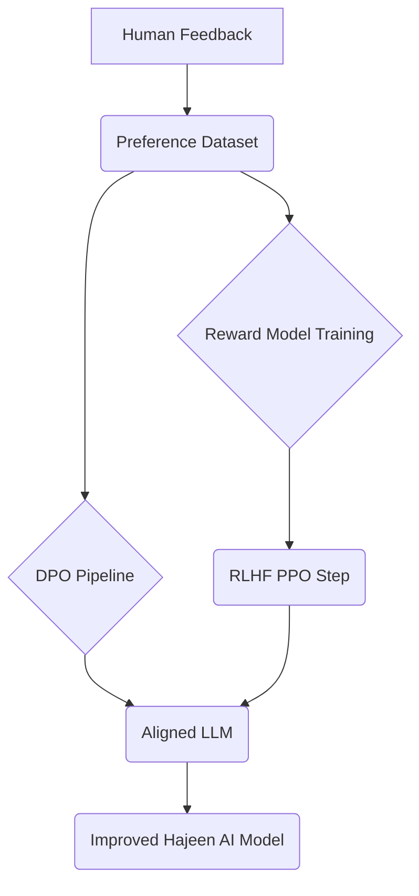

# المرحلة الثالثة: بناء بنية التوافق والتعلم المعزز (Alignment and RLHF Infrastructure)

تركز هذه المرحلة على بناء البنية التحتية اللازمة لمواءمة نماذج الذكاء الاصطناعي مع التفضيلات البشرية والقيم الأخلاقية، باستخدام تقنيات مثل Direct Preference Optimization (DPO) و Reinforcement Learning from Human Feedback (RLHF). الهدف هو جعل نماذج Hajeen AI أكثر أمانًا، فائدة، وتوافقًا مع توقعات المستخدمين.

## المكونات الرئيسية التي تم تجهيزها:

### 1. DPO Pipeline (`dpo_pipeline.py`)
- **الوظيفة:** توفير إطار عمل مبسط لتطبيق Direct Preference Optimization (DPO)، وهي طريقة فعالة لمواءمة النماذج اللغوية الكبيرة (LLMs) باستخدام بيانات التفضيلات البشرية.
- **الميزات:**
    - **تحضير بيانات التفضيلات:** تحويل البيانات الخام إلى تنسيق `(prompt, chosen_response, rejected_response)` المناسب لتدريب DPO.
    - **خطوة التدريب المحاكاة:** محاكاة خطوة تدريب واحدة لـ DPO، والتي تتضمن حساب الخسارة (loss) وتحديث النموذج.
    - **تشغيل خط الأنابيب:** تشغيل دورة تدريب DPO كاملة عبر مجموعة من بيانات التفضيلات.

### 2. RLHF Infrastructure (`rlhf_infrastructure.py`)
- **الوظيفة:** توفير بنية تحتية مبسطة لتطبيق Reinforcement Learning from Human Feedback (RLHF)، وهي تقنية قوية لمواءمة النماذج من خلال التعلم المعزز بناءً على التقييمات البشرية.
- **الميزات:**
    - **جمع التغذية الراجعة البشرية المحاكاة:** محاكاة عملية جمع التفضيلات البشرية للردود التي يولدها النموذج.
    - **تدريب نموذج المكافأة المحاكاة:** محاكاة تدريب نموذج المكافأة (Reward Model) الذي يتعلم التنبؤ بالتفضيلات البشرية.
    - **خطوة PPO المحاكاة:** محاكاة خطوة واحدة من Proximal Policy Optimization (PPO)، وهي خوارزمية التعلم المعزز المستخدمة لتحديث نموذج السياسة (Policy Model) بناءً على مخرجات نموذج المكافأة.
    - **تشغيل خط أنابيب RLHF:** تشغيل دورة RLHF كاملة، من جمع التغذية الراجعة إلى تدريب نموذج المكافأة وتحديث نموذج السياسة.

## التكامل والتشغيل:

تم تصميم هذه المكونات لتكون وحدات بناء يمكن دمجها في مسارات عمل مواءمة النماذج. في بيئة إنتاجية حقيقية، سيتطلب تشغيل هذه الأطر موارد حاسوبية كبيرة (خاصة وحدات معالجة الرسوميات GPU) وبيانات تفضيلات بشرية حقيقية. توفر هذه الملفات الأساس المفاهيمي والبرمجي لتطوير هذه القدرات في Hajeen AI Platform.

### مثال على بنية المواءمة والتعلم المعزز:

تهدف هذه المرحلة إلى تمكين Hajeen AI Platform من تطوير نماذج ذكاء اصطناعي ليست فقط قوية من الناحية التقنية، ولكن أيضًا مسؤولة ومتوافقة مع القيم البشرية، مما يعزز الثقة في النظام ومخرجاته.
