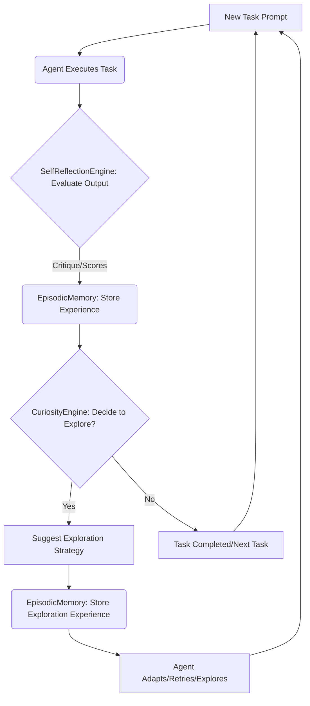

# المرحلة الرابعة: تفعيل حلقة التعلم الآلي المستمر (Continuous Self-Improvement Loop)

تركز هذه المرحلة على دمج المكونات السابقة (محرك التفكير الذاتي، ذاكرة الخبرات، ومحرك الفضول) في حلقة تعلم مستمرة، مما يسمح لوكلاء Hajeen AI بالتعلم والتكيف والتحسين الذاتي بشكل مستقل. هذه الحلقة هي جوهر تحويل المنصة إلى نظام ذكاء اصطناعي يتطور ذاتيًا.

## المكونات الرئيسية التي تم تجهيزها:

### 1. ContinuousLearningLoop (`continuous_learning_loop.py`)
- **الوظيفة:** هو المنسق الرئيسي الذي يدير دورة التعلم الكاملة. يقوم بتنفيذ المهام، ثم يطلق عمليات التفكير الذاتي، تخزين الخبرات، واتخاذ قرار الاستكشاف بناءً على النتائج.
- **الميزات:**
    - **تنفيذ المهام (`execute_and_learn`):** يستقبل مهمة (prompt) ويقوم بتنفيذها باستخدام وظيفة الوكيل المحددة. يسجل المخرجات، الإجراءات المتخذة، ومستوى الثقة.
    - **التفكير الذاتي:** يستدعي `SelfReflectionEngine` لتقييم مخرجات الوكيل. يمكن أن يؤدي التقييم السلبي إلى تغيير حالة نجاح المهمة، حتى لو كان الوكيل قد أبلغ عن نجاح مبدئي.
    - **تخزين الخبرات:** يقوم بتسجيل كل تفاعل (المهمة، الإجراءات، النتيجة، النجاح/الفشل، والتفكير الذاتي) في `EpisodicMemory`، مما يوفر قاعدة بيانات غنية للتعلم المستقبلي.
    - **قرار الاستكشاف:** يستخدم `CuriosityEngine` لتحديد ما إذا كان يجب على الوكيل استكشاف استراتيجيات جديدة بناءً على الثقة المنخفضة أو الفشل المتكرر. إذا تم اتخاذ قرار الاستكشاف، يتم اقتراح استراتيجية وتسجيلها كخبرة تعلم.
    - **التعلم من الفشل والنجاح:** يضمن أن النظام يتعلم من كل من التجارب الناجحة والفاشلة، مما يعزز قدرته على التكيف.

## التكامل والتشغيل:

تتكامل `ContinuousLearningLoop` كطبقة عليا تنسق بين `SelfReflectionEngine`، `EpisodicMemory`، و `CuriosityEngine`. كل مهمة يتم تنفيذها تمر عبر هذه الحلقة، مما يضمن أن كل تفاعل يساهم في تحسين أداء النظام على المدى الطويل. هذا يسمح لـ Hajeen AI بأن يصبح نظامًا "يتعلم من نفسه"، حيث تتراكم المعرفة والخبرة مع كل عملية تنفيذ.

### مثال على حلقة التعلم المستمر:

تهدف هذه المرحلة إلى إغلاق حلقة التعلم، مما يجعل Hajeen AI نظامًا ديناميكيًا يتطور باستمرار. من خلال التفكير النقدي في أدائه، وتذكر خبراته، واستكشاف طرق جديدة، يمكن للمنصة أن تحقق مستويات غير مسبوقة من الاستقلالية والذكاء طويل المدى.
