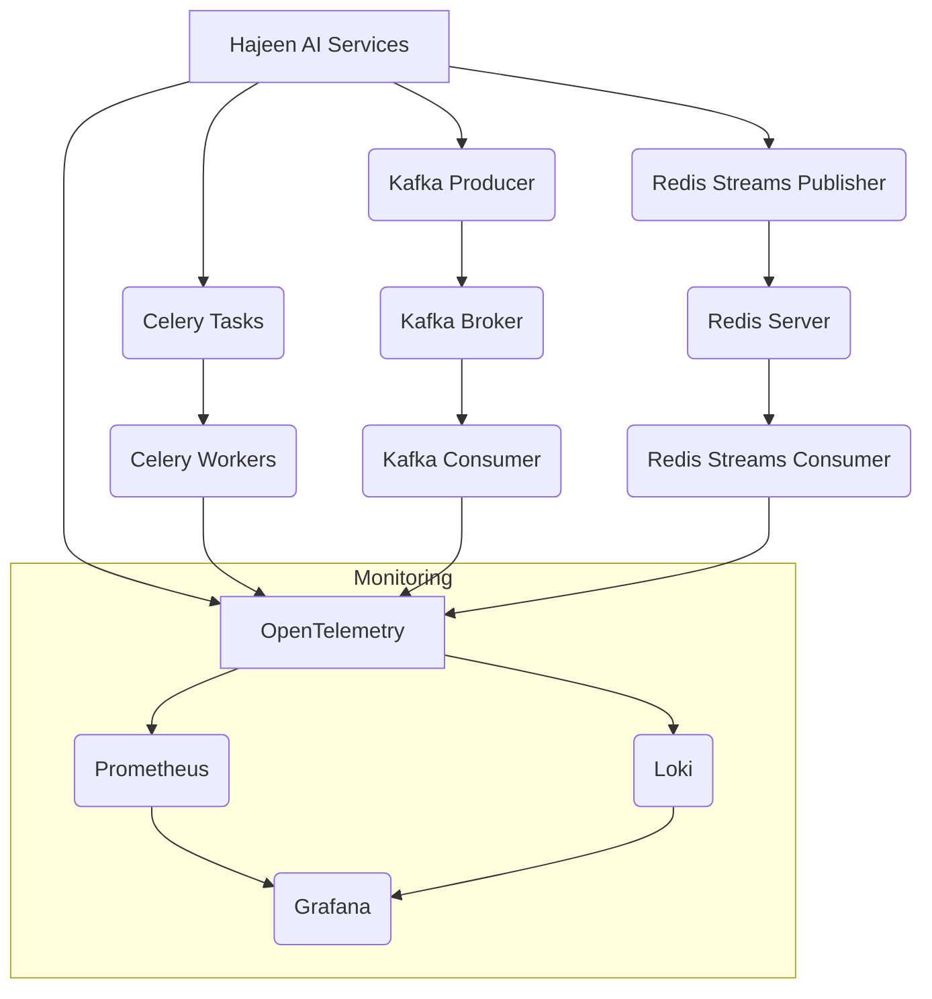

# المرحلة الرابعة: إعداد نظام التنفيذ الموزع والمراقبة (Distributed Execution and Monitoring Setup)

تركز هذه المرحلة على بناء بنية تحتية قوية للتنفيذ الموزع للعمليات غير المتزامنة (asynchronous operations) ومعالجة البيانات، بالإضافة إلى إعداد نظام مراقبة شامل لضمان استقرار وأداء Hajeen AI Platform. الهدف هو تمكين النظام من التعامل مع أحمال العمل الكبيرة بكفاءة، وتوفير رؤية عميقة حول صحته وسلوكه.

## المكونات الرئيسية التي تم تجهيزها:

### 1. Celery for Distributed Task Queue (`celery_config.py`)
- **الوظيفة:** إعداد Celery كطابور مهام موزع لمعالجة المهام الطويلة الأمد أو المهام التي تتطلب موارد مكثفة بشكل غير متزامن.
- **الميزات:**
    - **معالجة المهام غير المتزامنة:** يسمح بتفريغ المهام من مسار الطلب الرئيسي، مما يحسن استجابة النظام.
    - **التوسع الأفقي:** يمكن إضافة المزيد من العمال (workers) لزيادة قدرة المعالجة.
    - **إدارة المهام:** يوفر آليات لإدارة المهام، مثل إعادة المحاولة، الجدولة، وتتبع النتائج.

### 2. Kafka for Event Streaming (`kafka_integration.py`)
- **الوظيفة:** توفير تكامل مع Apache Kafka كمنصة بث أحداث (event streaming platform) عالية الإنتاجية وقابلة للتوسع.
- **الميزات:**
    - **معالجة الأحداث في الوقت الفعلي:** يسمح بمعالجة تدفقات البيانات والأحداث في الوقت الفعلي.
    - **قابلية التوسع والمتانة:** مصمم للتعامل مع كميات هائلة من البيانات وضمان عدم فقدان البيانات.
    - **فصل المكونات:** يتيح فصل المنتجين (producers) والمستهلكين (consumers) للأحداث، مما يزيد من مرونة النظام.

### 3. Redis Streams for Real-time Messaging (`redis_streams_integration.py`)
- **الوظيفة:** استخدام Redis Streams كبنية بيانات قابلة للإلحاق فقط (append-only data structure) لدعم تبادل الرسائل في الوقت الفعلي وأنماط عمل مجموعات المستهلكين (consumer groups).
- **الميزات:**
    - **رسائل في الوقت الفعلي:** مثالي لسيناريوهات المراسلة السريعة والتواصل بين الخدمات.
    - **مجموعات المستهلكين:** يدعم توزيع الرسائل على مجموعات من المستهلكين، مما يضمن معالجة كل رسالة مرة واحدة فقط.
    - **المثابرة:** يمكن تكوينها لمثابرة البيانات، مما يضمن عدم فقدان الرسائل حتى في حالة إعادة تشغيل الخادم.

### 4. Monitoring Setup (Prometheus, Grafana, Loki, OpenTelemetry) (`monitoring_setup.md`)
- **الوظيفة:** إعداد نظام مراقبة شامل باستخدام أدوات رائدة في الصناعة لتوفير رؤية عميقة حول صحة وأداء النظام.
- **الميزات:**
    - **Prometheus:** لجمع المقاييس (metrics) والتنبيهات.
    - **Grafana:** لتصور البيانات وإنشاء لوحات تحكم تفاعلية.
    - **Loki:** لتجميع السجلات (logs) والبحث فيها بكفاءة.
    - **OpenTelemetry:** لإنشاء تتبعات موزعة (distributed traces) عبر الخدمات لتتبع مسار الطلبات.

## التكامل والتشغيل:

تم تصميم هذه المكونات للعمل معًا لتوفير بنية تحتية قوية للتنفيذ الموزع والمراقبة. يمكن نشر Celery و Kafka و Redis Streams كخدمات مستقلة أو ضمن بيئة Kubernetes. يضمن نظام المراقبة المتكامل أن جميع هذه المكونات تعمل بسلاسة، ويوفر الأدوات اللازمة لتحديد المشكلات وحلها بسرعة.

### مثال على بنية التنفيذ الموزع والمراقبة:

تهدف هذه المرحلة إلى تمكين Hajeen AI Platform من التعامل مع متطلبات الإنتاج المعقدة، وتقديم أداء عالٍ، وموثوقية استثنائية، مع توفير الأدوات اللازمة لإدارة وتشغيل النظام بكفاءة.
