# Hajeen AI - Cognitive Operating System Class Design

This document outlines the proposed class design for the Hajeen Cognitive Operating System, focusing on the new components and their interactions. The design emphasizes modularity, scalability, and maintainability, ensuring compatibility with the existing Brain V3 architecture.

## 1. Core Principles

*   **Modularity:** Each major component will be encapsulated within its own set of classes, promoting loose coupling and high cohesion.
*   **Abstraction:** Interfaces will be defined for key functionalities to allow for flexible implementations and future extensions.
*   **Dependency Injection:** Dependencies will be managed to facilitate testing and maintainability.
*   **Event-Driven Architecture:** Components will communicate primarily through events, enabling asynchronous processing and responsiveness.

## 2. Class Diagram (Conceptual)

```mermaid
classDiagram
    direction LR

    class CognitiveOperatingSystem {
        + start()
        + stop()
        + process_input(input)
    }

    class BrainV3 {
        + reason(query)
        + decide(context)
        + retrieve_knowledge(concept_id)
        + update_memory(experience)
    }

    class CognitiveCompiler {
        + compile_input(raw_input): CognitiveEvent
        + extract_facts(event): List<Fact>
        + extract_concepts(event): List<Concept>
        + discover_relationships(facts, concepts): List<Relationship>
        + validate_evidence(data): ValidationResult
        + update_knowledge_graph(updates)
        + update_cognitive_dna(concept_id, updates)
        + store_experience(experience)
        + update_world_model(updates)
        + improve_reasoning(feedback)
        + meta_evaluate(process_data): EvaluationReport
    }

    class CognitiveEventSystem {
        + create_event(raw_input): CognitiveEvent
        + store_event(event)
        + get_event(event_id): CognitiveEvent
        + get_events_by_type(event_type): List<CognitiveEvent>
    }

    class ConceptEngine {
        + create_concept(name, definition): Concept
        + get_concept(concept_id): Concept
        + update_concept(concept_id, updates)
        + get_related_concepts(concept_id): List<Concept>
    }

    class CognitiveDNA {
        + create_dna(concept_id, source_info): DNA
        + get_dna(dna_id): DNA
        + update_dna(dna_id, updates)
        + get_dna_by_concept(concept_id): DNA
    }

    class KnowledgePhysicsEngine {
        + discover_causal_laws(data): List<CausalRelationship>
        + validate_causal_law(law): ValidationResult
        + predict_effects(cause_concept_id): List<Effect>
    }

    class EvidenceCourt {
        + evaluate_information(info): ConfidenceScore
        + analyze_source(source): SourceReport
        + compare_with_knowledge(info): ContradictionReport
        + request_additional_evidence(info): Request
    }

    class HypothesisEngine {
        + generate_hypotheses(problem): List<Hypothesis>
        + evaluate_hypothesis(hypothesis): EvaluationResult
        + gather_evidence(hypothesis): List<Evidence>
        + simulate_outcome(hypothesis): SimulationResult
        + select_strongest_hypothesis(hypotheses): Hypothesis
    }

    class ModelSociety {
        + register_model(model_info)
        + get_model_performance(model_id): ModelPerformance
        + route_query_to_model(query, domain): ModelResponse
        + initiate_debate(models, conflicting_results): DebateProtocol
        + judge_debate(debate_protocol): FinalDecision
    }

    class ExperimentEngine {
        + design_experiment(hypothesis): ExperimentDesign
        + execute_experiment(experiment_design): ExperimentResult
        + analyze_results(experiment_result): AnalysisReport
        + update_confidence(concept_id, impact)
    }

    class ExperienceMemory {
        + store_experience(task, attempt, result, failure, correction, lesson_learned, future_strategy)
        + retrieve_experiences(query): List<Experience>
        + analyze_experience(experience_id): InsightReport
    }

    class CuriosityEngine {
        + identify_knowledge_gaps(): List<KnowledgeGap>
        + generate_new_questions(gap): List<Question>
        + create_learning_plan(questions): LearningPlan
        + suggest_data_sources(plan): List<DataSource>
    }

    class WorldModel {
        + build_entity(data): Entity
        + update_entity(entity_id, updates)
        + predict_events(context): List<Prediction>
        + infer_relationships(entities): List<Relationship>
    }

    class DreamEngine {
        + reorganize_memory()
        + merge_concepts()
        + detect_contradictions()
        + refine_relationships()
        + cleanse_knowledge()
        + generate_new_hypotheses()
    }

    class MetaBrainLayer {
        + monitor_reasoning_performance(): PerformanceReport
        + identify_weaknesses(report): List<Weakness>
        + propose_strategies(weakness): List<Strategy>
        + experiment_strategy(strategy): ExperimentResult
        + compare_results(results): ComparisonReport
        + improve_architecture(recommendations)
    }

    class CognitiveEvolutionProtocol {
        + observe(): Observation
        + analyze(observation): Analysis
        + hypothesize_improvement(analysis): ImprovementHypothesis
        + experiment(hypothesis): ExperimentResult
        + evaluate(result): Evaluation
        + adopt(change): Version
        + rollback(version_id)
    }

    class CognitiveConstitution {
        + enforce_rule(rule_id, action): EnforcementResult
        + get_rules(): List<Rule>
        + check_compliance(action): ComplianceReport
    }

    class CognitiveVersionControl {
        + create_version(changes, reason): Version
        + get_version(version_id): Version
        + rollback_to_version(version_id)
        + get_evolution_history(concept_id): List<Version>
    }

    CognitiveOperatingSystem o-- BrainV3
    CognitiveOperatingSystem o-- CognitiveCompiler
    CognitiveOperatingSystem o-- CognitiveEventSystem
    CognitiveOperatingSystem o-- ConceptEngine
    CognitiveOperatingSystem o-- CognitiveDNA
    CognitiveOperatingSystem o-- KnowledgePhysicsEngine
    CognitiveOperatingSystem o-- EvidenceCourt
    CognitiveOperatingSystem o-- HypothesisEngine
    CognitiveOperatingSystem o-- ModelSociety
    CognitiveOperatingSystem o-- ExperimentEngine
    CognitiveOperatingSystem o-- ExperienceMemory
    CognitiveOperatingSystem o-- CuriosityEngine
    CognitiveOperatingSystem o-- WorldModel
    CognitiveOperatingSystem o-- DreamEngine
    CognitiveOperatingSystem o-- MetaBrainLayer
    CognitiveOperatingSystem o-- CognitiveEvolutionProtocol
    CognitiveOperatingSystem o-- CognitiveConstitution
    CognitiveOperatingSystem o-- CognitiveVersionControl

    CognitiveCompiler ..> CognitiveEventSystem
    CognitiveCompiler ..> ConceptEngine
    CognitiveCompiler ..> CognitiveDNA
    CognitiveCompiler ..> KnowledgePhysicsEngine
    CognitiveCompiler ..> EvidenceCourt
    CognitiveCompiler ..> ExperienceMemory
    CognitiveCompiler ..> WorldModel

    CognitiveEventSystem ..> ExperienceMemory

    ConceptEngine ..> CognitiveDNA
    ConceptEngine ..> KnowledgePhysicsEngine

    KnowledgePhysicsEngine ..> EvidenceCourt

    EvidenceCourt ..> HypothesisEngine

    HypothesisEngine ..> ModelSociety
    HypothesisEngine ..> ExperimentEngine

    ModelSociety ..> ExperimentEngine

    ExperimentEngine ..> ExperienceMemory

    ExperienceMemory ..> CuriosityEngine
    ExperienceMemory ..> WorldModel

    CuriosityEngine ..> CognitiveEvolutionProtocol

    WorldModel ..> DreamEngine

    DreamEngine ..> MetaBrainLayer

    MetaBrainLayer ..> CognitiveEvolutionProtocol

    CognitiveEvolutionProtocol ..> CognitiveConstitution
    CognitiveEvolutionProtocol ..> CognitiveVersionControl

    BrainV3 <.. CognitiveCompiler : Integrates with
    BrainV3 <.. ConceptEngine : Enhances Knowledge Graph
    BrainV3 <.. ExperienceMemory : Extends Memory Fabric
    BrainV3 <.. MetaBrainLayer : Monitors & Optimizes
    BrainV3 <.. CognitiveEvolutionProtocol : Drives Evolution

    CognitiveCompiler ..> BrainV3 : Updates

```

## 3. Detailed Class Descriptions

### 3.1. `CognitiveOperatingSystem`

**Purpose:** The main entry point and orchestrator for the entire Hajeen Cognitive Operating System. It manages the lifecycle of all major components and coordinates their interactions.

**Key Methods:**
*   `start()`: Initializes all components and starts the system.
*   `stop()`: Shuts down all components and gracefully terminates the system.
*   `process_input(input)`: Receives raw input and initiates the cognitive processing pipeline through the `CognitiveCompiler`.

### 3.2. `CognitiveCompiler`

**Purpose:** Responsible for transforming raw input into structured cognitive events and knowledge updates. It acts as the central processing unit for all incoming information.

**Key Methods:**
*   `compile_input(raw_input)`: Takes raw input and orchestrates the extraction and validation process, returning a `CognitiveEvent`.
*   `extract_facts(event)`: Identifies and extracts factual statements from a cognitive event.
*   `extract_concepts(event)`: Extracts key concepts and entities.
*   `discover_relationships(facts, concepts)`: Identifies relationships between extracted facts and concepts.
*   `validate_evidence(data)`: Utilizes the `EvidenceCourt` to validate extracted information.
*   `update_knowledge_graph(updates)`: Integrates new knowledge into the `KnowledgeGraph` (part of Brain V3).
*   `update_cognitive_dna(concept_id, updates)`: Updates the `CognitiveDNA` of relevant concepts.
*   `store_experience(experience)`: Stores processed experiences in `ExperienceMemory`.
*   `update_world_model(updates)`: Updates the `WorldModel` with new information.
*   `improve_reasoning(feedback)`: Provides feedback to the `ReasoningEngine` (part of Brain V3) for improvement.
*   `meta_evaluate(process_data)`: Performs meta-evaluation of the compilation process.

### 3.3. `CognitiveEventSystem`

**Purpose:** Manages the creation, storage, and retrieval of `CognitiveEvent` objects, which encapsulate the full context of cognitive interactions.

**Key Methods:**
*   `create_event(raw_input)`: Constructs a `CognitiveEvent` object from raw input.
*   `store_event(event)`: Persists a `CognitiveEvent` to the database.
*   `get_event(event_id)`: Retrieves a `CognitiveEvent` by its ID.
*   `get_events_by_type(event_type)`: Retrieves a list of events filtered by type.

### 3.4. `ConceptEngine`

**Purpose:** Manages the lifecycle and properties of cognitive concepts, evolving the traditional Knowledge Graph into a dynamic system of interconnected conceptual entities.

**Key Methods:**
*   `create_concept(name, definition)`: Creates a new concept with its initial definition.
*   `get_concept(concept_id)`: Retrieves a concept by its ID.
*   `update_concept(concept_id, updates)`: Modifies the properties of an existing concept.
*   `get_related_concepts(concept_id)`: Retrieves concepts related to a given concept.

### 3.5. `CognitiveDNA`

**Purpose:** Manages the metadata and evolutionary history of individual concepts, providing insights into their origin, quality, and changes over time.

**Key Methods:**
*   `create_dna(concept_id, source_info)`: Initializes the cognitive DNA for a new concept.
*   `get_dna(dna_id)`: Retrieves cognitive DNA by its ID.
*   `update_dna(dna_id, updates)`: Modifies the attributes of a concept's DNA.
*   `get_dna_by_concept(concept_id)`: Retrieves the DNA associated with a specific concept.

### 3.6. `KnowledgePhysicsEngine`

**Purpose:** Discovers, validates, and models causal relationships within the knowledge base, moving beyond simple graph connections to understanding underlying 
causal laws.

**Key Methods:**
*   `discover_causal_laws(data)`: Analyzes data to identify potential causal relationships.
*   `validate_causal_law(law)`: Tests and validates a proposed causal law.
*   `predict_effects(cause_concept_id)`: Predicts potential effects given a cause based on established causal laws.

### 3.7. `EvidenceCourt`

**Purpose:** Acts as a gatekeeper for new information, rigorously evaluating its credibility and consistency before it is integrated into the system's long-term memory.

**Key Methods:**
*   `evaluate_information(info)`: Assesses the trustworthiness and validity of new information.
*   `analyze_source(source)`: Examines the origin and reliability of an information source.
*   `compare_with_knowledge(info)`: Checks for contradictions or inconsistencies with existing knowledge.
*   `request_additional_evidence(info)`: Initiates a request for more supporting data if needed.

### 3.8. `HypothesisEngine`

**Purpose:** Generates and evaluates multiple hypotheses for a given problem, simulating outcomes and selecting the most plausible solution based on available evidence.

**Key Methods:**
*   `generate_hypotheses(problem)`: Creates a set of potential explanations or solutions.
*   `evaluate_hypothesis(hypothesis)`: Assesses the strength and feasibility of a single hypothesis.
*   `gather_evidence(hypothesis)`: Collects supporting data for a hypothesis.
*   `simulate_outcome(hypothesis)`: Models the potential results of a hypothesis.
*   `select_strongest_hypothesis(hypotheses)`: Chooses the best hypothesis from a set.

### 3.9. `ModelSociety`

**Purpose:** Manages external AI models as a society of experts, routing queries, evaluating performance, and resolving disagreements through a debate protocol.

**Key Methods:**
*   `register_model(model_info)`: Adds a new external model to the society.
*   `get_model_performance(model_id)`: Retrieves performance metrics for a specific model.
*   `route_query_to_model(query, domain)`: Directs a query to the most suitable model(s).
*   `initiate_debate(models, conflicting_results)`: Starts a debate process when models provide conflicting answers.
*   `judge_debate(debate_protocol)`: Makes a final decision based on the debate outcome.

### 3.10. `ExperimentEngine`

**Purpose:** Facilitates the design, execution, and analysis of experiments to test hypotheses, validate knowledge, and update confidence levels within the system.

**Key Methods:**
*   `design_experiment(hypothesis)`: Creates a plan for testing a hypothesis.
*   `execute_experiment(experiment_design)`: Runs the experiment and collects results.
*   `analyze_results(experiment_result)`: Interprets the data from an experiment.
*   `update_confidence(concept_id, impact)`: Adjusts confidence scores based on experiment outcomes.

### 3.11. `ExperienceMemory`

**Purpose:** Stores rich, contextualized experiences, including tasks, attempts, results, failures, corrections, lessons learned, and future strategies, enabling the system to learn from its past.

**Key Methods:**
*   `store_experience(task, attempt, result, failure, correction, lesson_learned, future_strategy)`: Records a complete learning experience.
*   `retrieve_experiences(query)`: Searches for relevant past experiences.
*   `analyze_experience(experience_id)`: Extracts insights and patterns from a specific experience.

### 3.12. `CuriosityEngine`

**Purpose:** Drives autonomous exploration and learning by identifying knowledge gaps, generating new questions, and creating learning plans to expand the system's understanding.

**Key Methods:**
*   `identify_knowledge_gaps()`: Detects areas where the system's knowledge is incomplete or uncertain.
*   `generate_new_questions(gap)`: Formulates questions to address identified knowledge gaps.
*   `create_learning_plan(questions)`: Develops a strategy for acquiring new knowledge.
*   `suggest_data_sources(plan)`: Recommends sources for learning and data collection.

### 3.13. `WorldModel`

**Purpose:** Constructs and maintains an internal, dynamic representation of the external world, including entities, their properties, relationships, and causal laws, enabling prediction and inference.

**Key Methods:**
*   `build_entity(data)`: Creates or updates an entity within the world model.
*   `update_entity(entity_id, updates)`: Modifies an existing entity's attributes.
*   `predict_events(context)`: Forecasts future events based on the current world state.
*   `infer_relationships(entities)`: Discovers new relationships between entities.

### 3.14. `DreamEngine`

**Purpose:** Performs background cognitive processing during idle periods, optimizing memory, consolidating concepts, resolving inconsistencies, and generating new hypotheses to enhance the system's overall coherence and efficiency.

**Key Methods:**
*   `reorganize_memory()`: Optimizes the structure and accessibility of stored memories.
*   `merge_concepts()`: Combines redundant or related concepts.
*   `detect_contradictions()`: Identifies conflicting information within the knowledge base.
*   `refine_relationships()`: Improves the accuracy and strength of relationships.
*   `cleanse_knowledge()`: Removes outdated or irrelevant information.
*   `generate_new_hypotheses()`: Creates new ideas or theories for future exploration.

### 3.15. `MetaBrainLayer`

**Purpose:** The self-monitoring and self-improvement component of the system, responsible for analyzing its own performance, identifying weaknesses, and proposing architectural or strategic enhancements.

**Key Methods:**
*   `monitor_reasoning_performance()`: Tracks and evaluates the effectiveness of reasoning processes.
*   `identify_weaknesses(report)`: Pinpoints areas where the system's performance is suboptimal.
*   `propose_strategies(weakness)`: Suggests new approaches to address identified weaknesses.
*   `experiment_strategy(strategy)`: Tests proposed strategies to assess their impact.
*   `compare_results(results)`: Evaluates the effectiveness of different strategies.
*   `improve_architecture(recommendations)`: Implements changes to the system's internal structure.

### 3.16. `CognitiveEvolutionProtocol`

**Purpose:** Manages the continuous evolutionary cycle of the Hajeen AI, ensuring systematic observation, analysis, hypothesis generation, experimentation, evaluation, and adoption of improvements.

**Key Methods:**
*   `observe()`: Gathers data on system performance and environmental interactions.
*   `analyze(observation)`: Interprets observed data to identify patterns and insights.
*   `hypothesize_improvement(analysis)`: Formulates potential improvements based on analysis.
*   `experiment(hypothesis)`: Conducts tests to validate improvement hypotheses.
*   `evaluate(result)`: Assesses the success or failure of experiments.
*   `adopt(change)`: Integrates validated improvements into the system.
*   `rollback(version_id)`: Reverts the system to a previous stable state if an improvement fails.

### 3.17. `CognitiveConstitution`

**Purpose:** Enforces a set of fundamental, inviolable rules and ethical guidelines that govern the behavior and decision-making processes of the Hajeen AI.

**Key Methods:**
*   `enforce_rule(rule_id, action)`: Ensures that system actions comply with constitutional rules.
*   `get_rules()`: Retrieves the complete set of constitutional rules.
*   `check_compliance(action)`: Verifies an action against the established rules.

### 3.18. `CognitiveVersionControl`

**Purpose:** Provides a robust versioning system for the cognitive mind, tracking all changes, their rationale, evaluation results, and enabling the ability to revert to previous states.

**Key Methods:**
*   `create_version(changes, reason)`: Records a new version of the cognitive system with associated changes and reasons.
*   `get_version(version_id)`: Retrieves a specific version of the system.
*   `rollback_to_version(version_id)`: Restores the system to a previously saved version.
*   `get_evolution_history(concept_id)`: Provides a historical timeline of changes for a specific concept or component.

## 4. Integration with Brain V3

The existing Brain V3 components will be integrated with the new Cognitive Operating System components as follows:

*   **Brain V3's Knowledge Graph** will be enhanced and managed by the `ConceptEngine` and `CognitiveDNA`.
*   **Brain V3's Memory Fabric** will be extended and enriched by the `ExperienceMemory`.
*   **Brain V3's Model Router** will be superseded or integrated with the `ModelSociety` for more sophisticated model management.
*   **Brain V3's Reasoning Engine** will be augmented by the `HypothesisEngine` and `EvidenceCourt` for more robust and evidence-based reasoning.
*   The `MetaBrainLayer` and `CognitiveEvolutionProtocol` will provide continuous monitoring and improvement mechanisms for the entire Brain V3 and its new extensions.

This design ensures a seamless transition and enhancement of the existing Hajeen AI capabilities.
