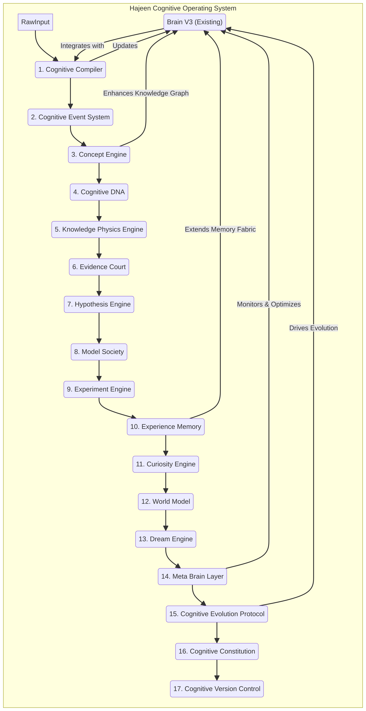

# Hajeen AI - Cognitive Operating System Architecture

## 1. Introduction

This document outlines the proposed architecture for evolving Hajeen AI from an AI platform into a sophisticated Cognitive Operating System. The goal is to enable the system to build knowledge, understand concepts, evaluate evidence, acquire experience, develop thinking strategies, and self-improve its internal architecture over time. The core principle is to create a system that changes its cognitive structure based on experience, where every experience contributes to the evolution of the mind.

## 2. Overall Architecture Diagram

Below is the high-level architecture diagram illustrating the components of the Hajeen Cognitive Operating System and their interactions.

## 3. Core Components and Their Functions

This section details the new components and their roles within the Cognitive Operating System.

### 3.1. Cognitive Compiler

**Function:** The central heart of knowledge processing. All raw input (information, experience, answers, results) must pass through the Cognitive Compiler before entering the system. It transforms raw data into structured cognitive events and knowledge updates.

**Process Flow:**
1.  **Raw Input:** Initial unstructured data.
2.  **Cognitive Event Creation:** Converts raw input into structured cognitive events.
3.  **Fact Extraction:** Identifies and extracts factual information.
4.  **Concept Extraction:** Extracts key concepts.
5.  **Relationship Discovery:** Identifies relationships between extracted facts and concepts.
6.  **Evidence Validation:** Validates the extracted information against existing knowledge.
7.  **Knowledge Graph Update:** Updates the Knowledge Graph with new information.
8.  **Cognitive DNA Update:** Updates the Cognitive DNA of relevant concepts.
9.  **Experience Memory:** Stores the processed experience.
10. **World Model Update:** Updates the internal World Model.
11. **Reasoning Improvement:** Uses new knowledge to improve reasoning strategies.
12. **Meta Evaluation:** Evaluates the overall process and outcomes.

### 3.2. Cognitive Event System

**Function:** A new fundamental layer for storing cognitive events rather than just raw text. Each event captures the full context and process of an interaction or learning experience.

**Event Structure:**
*   **Goal:** The objective of the cognitive event.
*   **Intent:** The underlying intention.
*   **Context:** The surrounding circumstances.
*   **Knowledge Used:** Specific knowledge applied.
*   **Models Consulted:** External models or experts consulted.
*   **Tools Used:** Tools or APIs utilized.
*   **Thinking Steps:** The reasoning process followed.
*   **Hypotheses:** Generated hypotheses.
*   **Evidence:** Supporting evidence.
*   **Results:** Outcomes of the event.
*   **Errors:** Any errors encountered.
*   **Success/Failure Reasons:** Analysis of why the event succeeded or failed.
*   **Confidence Level:** System's confidence in the outcome.
*   **Lessons Learned:** Insights gained from the event.

### 3.3. Concept Engine

**Function:** Evolves the existing Knowledge Graph into a true conceptual system where each concept is an independent cognitive entity.

**Concept Structure (Example: "Oil"):**
*   **Definition:** Formal definition.
*   **Properties:** Characteristics and attributes.
*   **Causes:** Factors leading to its existence or changes.
*   **Effects:** Consequences or impacts.
*   **Rules:** Governing principles.
*   **Exceptions:** Deviations from rules.
*   **Related Concepts:** Links to other concepts.
*   **Evidence:** Supporting data or observations.
*   **Confidence:** System's confidence in the concept's validity.
*   **History:** Evolution and changes over time.
*   **Experiences:** Related past experiences.
*   **Evolution Timeline:** Historical timeline of the concept's development.

### 3.4. Cognitive DNA

**Function:** Each concept possesses a cognitive DNA, providing detailed metadata about its origin, quality, and evolution. This enables a scalable schema design.

**DNA Attributes:**
*   **Knowledge Source:** Origin of the knowledge.
*   **Number of Sources:** Quantity of supporting sources.
*   **Source Quality:** Reliability and credibility of sources.
*   **Confidence Level:** System's confidence in the concept.
*   **Change Rate:** Frequency of concept updates.
*   **Stability:** Consistency over time.
*   **Causal Relationships:** Links to cause-and-effect relationships.
*   **Associated Experiences:** Related experiences.
*   **Last Updated:** Timestamp of the last modification.
*   **Evolution History:** Record of changes.

### 3.5. Knowledge Physics Engine

**Function:** Beyond a mere Knowledge Graph, this engine discovers and models causal laws and relationships, allowing the system to build testable causal hypotheses.

**Example:**
*   Rising Oil Prices → Increased Transportation Costs → Inflation → Monetary Policy Change.

This engine doesn't just store relationships but builds a testable causal base.

### 3.6. Evidence Court

**Function:** A system for evaluating new knowledge. Any new information must pass through this 
court before being integrated into long-term memory.

**Evaluation Process:**
*   **Source Analysis:** Analyzing the origin of the information.
*   **Quality Assessment:** Evaluating the quality and reliability.
*   **Comparison with Existing Knowledge:** Checking for consistency.
*   **Contradiction Detection:** Identifying conflicting information.
*   **Request for Additional Evidence:** Seeking further proof.
*   **Confidence Score Calculation:** Assigning a confidence score.

### 3.7. Hypothesis Engine

**Function:** An evolution of the current Reasoning Engine. Instead of producing a single answer, the system generates multiple hypotheses, evaluates each, gathers evidence, simulates outcomes, and selects the strongest hypothesis.

### 3.8. Model Society

**Function:** An advanced Model Router where external models are treated as experts with specialized domains, performance history, success rates, common errors, confidence levels, cost, and speed. When models disagree, a Debate Protocol is initiated, with Hajeen making the final judgment.

### 3.9. Experiment Engine

**Function:** Adds a layer for conducting experiments. Any testable information (code, equations, APIs, models) is tested, and the results are used to update confidence levels.

### 3.10. Experience Memory

**Function:** Expands the Memory Fabric to store complete experiences rather than just question-answer pairs. This includes:
*   **Task:** The objective.
*   **Attempt:** The execution.
*   **Result:** The outcome.
*   **Failure:** Any failures.
*   **Correction:** Corrective actions.
*   **Lesson Learned:** Insights gained.
*   **Future Strategy:** How to approach similar tasks in the future.

### 3.11. Curiosity Engine

**Function:** Enables the system to discover what it doesn't know, identify knowledge gaps, and determine what it needs to learn. It generates new questions, learning plans, and data sources, feeding them into the Continuous Learning Pipeline.

### 3.12. World Model

**Function:** Builds an internal model of the world, comprising entities, laws, relationships, causes, effects, and probabilities. This allows the system to predict and infer.

### 3.13. Dream Engine

**Function:** A background cognitive processing system that, during idle times, reorganizes memory, merges concepts, detects contradictions, refines relationships, cleanses knowledge, and generates new hypotheses.

### 3.14. Meta Brain Layer (Mandatory Component)

**Function:** This layer monitors the brain itself, analyzing the performance of the Reasoning Engine, identifying weaknesses, proposing new thinking strategies, experimenting with different approaches, comparing results, and improving the overall architecture.

**Example:** If a strategy consistently fails for a certain task type, it proposes a change, conducts an experiment, measures results, and then adopts or rejects the change.

### 3.15. Cognitive Evolution Protocol

**Function:** Defines the system's evolutionary cycle:
*   **Observe:** Monitor performance and environment.
*   **Analyze:** Evaluate observations.
*   **Hypothesize Improvement:** Propose changes.
*   **Experiment:** Test hypotheses.
*   **Evaluate:** Assess experiment results.
*   **Adopt:** Integrate successful changes.
*   **Version:** Create a new version.
*   **Rollback if Failed:** Revert changes if unsuccessful.

This ensures Hajeen not only learns but evolves.

### 3.16. Cognitive Constitution

**Function:** Establishes a set of inviolable rules for the cognitive system, such as:
*   Do not accept facts without evidence.
*   Do not reject new ideas without analysis.
*   Distinguish between fact and probability.
*   Acknowledge lack of knowledge.
*   Do not modify the system without testing.
*   Maintain an evolution history.

### 3.17. Cognitive Version Control

**Function:** A versioning system for the cognitive mind, similar to software version control. It tracks changes, reasons for changes, evaluations, and allows for rollbacks.

## 4. Requirements Before Implementation

Before commencing with code implementation, the following deliverables are required:

1.  **Architecture Diagram:** A complete and detailed architectural overview.
2.  **Data Flow Diagram:** Illustrating the flow of data through the system.
3.  **Database Schema:** Design of the database structure.
4.  **Class Design:** Detailed design of classes and objects.
5.  **API Design:** Specifications for all internal and external APIs.
6.  **Integration Plan with Brain V3:** A comprehensive plan for integrating new components with the existing Brain V3.
7.  **Phased Implementation Plan:** A step-by-step execution roadmap.
8.  **Risk Analysis:** Identification and mitigation strategies for potential risks.
9.  **Success Criteria:** Metrics and benchmarks for evaluating success.
10. **Test Plan:** A detailed plan for testing all components and functionalities.

## 5. Design Principles

The design must adhere to the following principles:

*   **Production Grade:** Robust, reliable, and ready for deployment.
*   **Modular:** Composed of independent, interchangeable components.
*   **Scalable:** Capable of handling increasing workloads and data volumes.
*   **Maintainable:** Easy to understand, modify, and debug.
*   **Compatible:** Seamlessly integrates with the existing Hajeen AI Brain V3 architecture.

## 6. Ultimate Goal

The ultimate goal is not to build a chatbot or merely an agent system, but to construct the core of an artificial cognitive mind capable of learning, evaluating, evolving, and improving its thinking processes over time.
