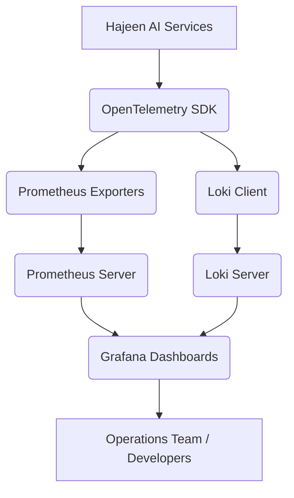

## إعداد نظام المراقبة (Monitoring Setup)

لضمان استقرار وأداء Hajeen AI Platform في بيئة الإنتاج، يتم دمج مجموعة من أدوات المراقبة القوية. توفر هذه الأدوات رؤى شاملة حول صحة النظام، الأداء، والسلوك، مما يتيح الكشف السريع عن المشكلات وحلها.

### 1. Prometheus
- **الوظيفة:** نظام مراقبة وتنبيه مفتوح المصدر. يقوم بجمع المقاييس (metrics) من الأهداف المكونة على فترات زمنية محددة، وتقييم قواعد التنبيه، وإطلاق التنبيهات إذا تم استيفاء الشروط.
- **التكامل مع Hajeen AI:**
    - سيتم تكوين تطبيقات وخدمات Hajeen AI (مثل Ray Serve، vLLM، Triton) لتصدير المقاييس بتنسيق Prometheus.
    - سيتم نشر Prometheus في بيئة Kubernetes لمراقبة جميع المكونات.
    - **مثال على مقاييس يمكن جمعها:** زمن استجابة الاستدلال، استخدام GPU، عدد الطلبات في الثانية، أخطاء الوكلاء.

### 2. Grafana
- **الوظيفة:** منصة مفتوحة المصدر لتحليل وتصور المقاييس. تعمل كواجهة مستخدم رسومية لعرض البيانات التي يجمعها Prometheus (أو مصادر بيانات أخرى) في لوحات تحكم (dashboards) تفاعلية.
- **التكامل مع Hajeen AI:**
    - سيتم إنشاء لوحات تحكم مخصصة في Grafana لعرض مقاييس الأداء الرئيسية لـ Hajeen AI.
    - ستوفر هذه اللوحات رؤى في الوقت الفعلي حول صحة النظام، أداء الوكلاء، استخدام الموارد، وأي مشكلات محتملة.

### 3. Loki
- **الوظيفة:** نظام تجميع سجلات (logging system) مصمم ليكون فعالاً من حيث التكلفة وقابلاً للتوسع. على عكس أنظمة السجلات التقليدية التي تفهرس المحتوى الكامل للسجلات، يقوم Loki بفهرسة البيانات الوصفية فقط (metadata)، مما يجعله أسرع وأقل استهلاكًا للموارد.
- **التكامل مع Hajeen AI:**
    - سيتم تكوين جميع خدمات Hajeen AI لإرسال سجلاتها إلى Loki.
    - يمكن للمطورين استخدام Grafana (المتكامل مع Loki) للبحث في السجلات وتحليلها جنبًا إلى جنب مع المقاييس، مما يسهل استكشاف الأخطاء وإصلاحها.

### 4. OpenTelemetry
- **الوظيفة:** مجموعة من الأدوات، واجهات برمجة التطبيقات (APIs)، ومجموعات تطوير البرامج (SDKs) المفتوحة المصدر لإنشاء وإدارة بيانات القياس عن بعد (telemetry data) مثل التتبع (traces)، المقاييس (metrics)، والسجلات (logs).
- **التكامل مع Hajeen AI:**
    - سيتم دمج OpenTelemetry في الكود البرمجي لخدمات Hajeen AI لإنشاء تتبعات موزعة (distributed traces).
    - ستسمح هذه التتبعات بتتبع مسار الطلب عبر الخدمات المتعددة، مما يساعد في تحديد نقاط الاختناق (bottlenecks) ومشكلات الأداء في البنية الموزعة.

## بنية المراقبة المتكاملة:

يوفر هذا الإعداد المتكامل رؤية شاملة لأداء النظام وصحته، مما يدعم التشغيل الفعال والموثوق لـ Hajeen AI Platform في بيئات الإنتاج المعقدة.
